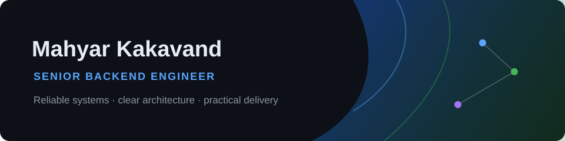

   

I design dependable backend systems for products with complex business workflows. My work spans distributed services, e-commerce, and fintech/crypto platforms, with an emphasis on maintainable APIs, explicit domain boundaries, and pragmatic event-driven architecture.

Based in Tehran, Iran — open to worldwide remote Senior Backend Engineer opportunities.

  

## What I work on

- Turning product requirements into clear, resilient backend services
- Designing maintainable APIs and service boundaries for evolving domains
- Improving reliability through observability, performance testing, and thoughtful operational practices
- Building asynchronous workflows where they make systems more reliable and easier to scale

## Technical toolkit

| Area | Technologies |
| --- | --- |
| **Backend** | Node.js, TypeScript, NestJS, REST APIs |
| **Architecture** | Domain-driven design, microservices, event-driven workflows, Kafka |
| **Data** | MySQL, MariaDB, MongoDB, Redis, MinIO, Meilisearch |
| **Platform** | Docker, Docker Compose, Traefik, GitHub Actions, Keycloak |
| **Observability** | Prometheus, Grafana, Sentry, k6 |

## Open source

- [**nestjs-saga**](https://github.com/MahyaR-Kd/nestjs-saga) — A NestJS-oriented library for coordinating multi-step application workflows with the saga pattern.
- [**nestjs-minio**](https://github.com/MahyaR-Kd/nestjs-minio) — A NestJS module for clean MinIO object-storage integration.

## Find me

[Portfolio](https://mahyarkd.com) · [LinkedIn](https://www.linkedin.com/in/mahyar-kakavand) · [GitHub](https://github.com/MahyaR-Kd)
